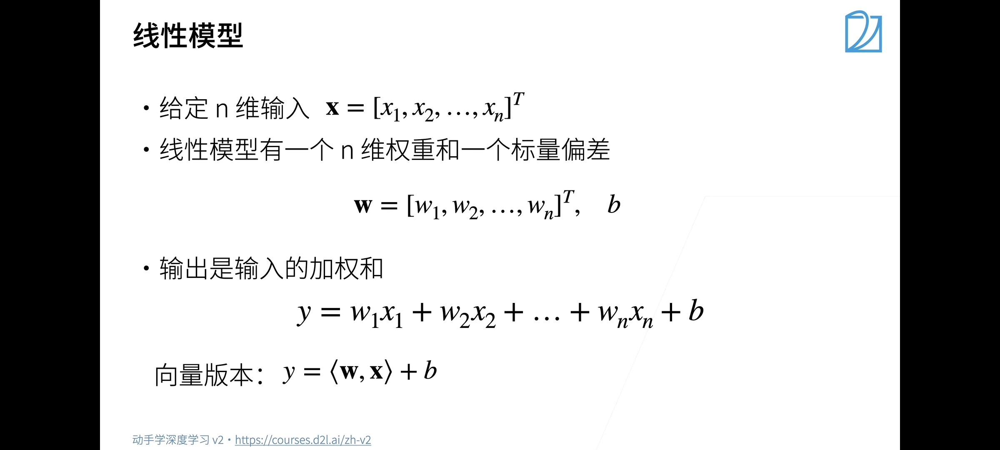
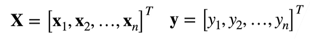
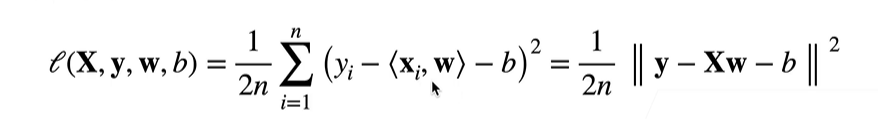
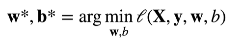
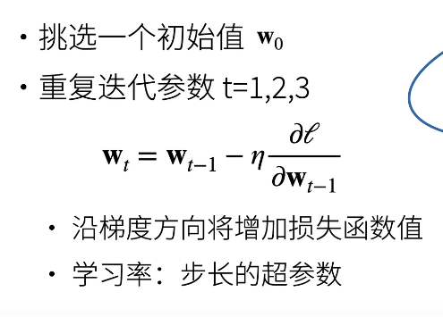

# 线性回归
## 线性模型

### 1. 线性模型可以看作是单层的神经网络

> input--->  
input--->    output  
input--->  

### 2. 衡量预估的质量
例如平方损失 

### 3. 训练数据

- 收集过去的数据点来决定参数值（权重和偏差）叫做训练数据,越多越好  
- 设n个样本参数  

### 4.参数学习
- 训练损失   

- 最小化损失来学习参数  

### 5.线性回归是存在显示解的

## 基础优化算法
### 1. 梯度下降

  

lr（η）的设定既不能太大也不能太小

### 2.小批量随机梯度下降
将数据分批，使用采样数据近似损失  
batch_size不可太大也不可太小

### 3. 总结
- 梯度下降是随着反梯度的方向不断更新参数求解
- 小批量随机梯度下降是深度学习的默认学习算法
- lr（学习率），batch_size是两个超参数