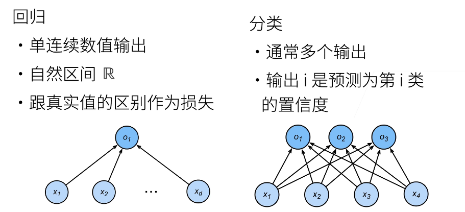
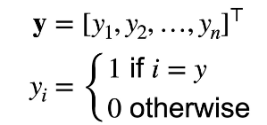
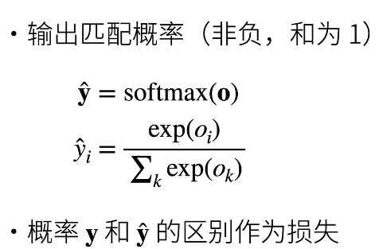
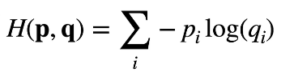
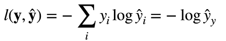
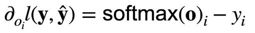
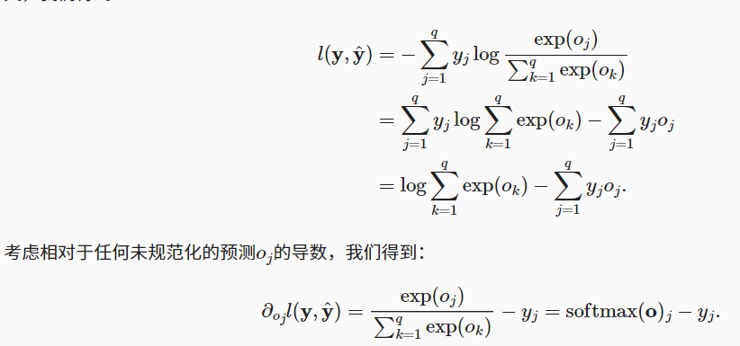

# 一、softmax回归
softmax实际上是分类问题
## 1.回归和分类的区别
- 回归是估计一个连续的值  
- 分类是预测一个离散类别  
  
### 2.one-hot编码
***使用one-hot对类别进行编码***  
  
### 3. 校验比例
  

***经过softmaax之后每个元素都非负并且和为一***  

### 4.交叉熵
  

***交叉熵一般用来计算两个概率的区别***  

- ***如果用作损失***  
  
真实值是独热编码，所以求和时，除了目标项其他项都是0而目标项又是1，所以可以化简
- ***它的梯度就是***  
  
具体的推导  
  

### 5.总结
- softmax回归是一个分类回归问题
- 使用softmax操作子获得每个类预测置信度
- 使用交叉熵来衡量预测和标号的区别