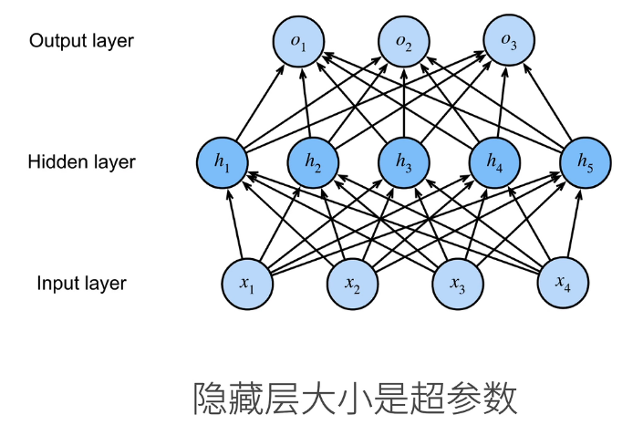

- [一、单层感知机](#一单层感知机)
  - [1. 感知机](#1-感知机)
  - [2. 训练感知机](#2-训练感知机)
  - [3. 收敛定理](#3-收敛定理)
  - [4.缺点-](#4缺点-)
  - [5. 总结](#5-总结)
- [二、多层感知机](#二多层感知机)
  - [1. 解决XOR问题](#1-解决xor问题)
  - [2. 单隐藏层](#2-单隐藏层)
    - [a. 单分类](#a-单分类)
    - [b. 多分类](#b-多分类)
  - [5. 多隐藏层](#5-多隐藏层)
  - [4. 激活函数](#4-激活函数)
    - [a. Sigmoid函数](#a-sigmoid函数)
    - [b. Tanh函数](#b-tanh函数)
    - [c. ReLU函数](#c-relu函数)
  - [5. 总结](#5-总结-1)

# 一、单层感知机
## 1. 感知机

## 2. 训练感知机

***当预测值的符号与目标值不同时即预测错误***

## 3. 收敛定理

***用来确定模型的收敛***

## 4.缺点  
***无法确定XOR问题，因为只能产生线性分割面***

推出多层感知机

## 5. 总结
- 感知机是二分类问题
- 求解算法等价于使用批量为1的随机梯度下降
- 无法解决XOR问题

# 二、多层感知机

## 1. 解决XOR问题
通过多次判断结合求解，中间会出现一层隐藏的操作子，称为单隐藏层

## 2. 单隐藏层

### a. 单分类

- 激活函数的意义：在多层线性模型时，若不加入激活函数，因为两层线性相乘后仍然时一层线性，会导致层数塌陷，
- 激活函数必须时非线性的：若是线性的会导致模型仍然是线性的，起不到作用

### b. 多分类

***softmax加了隐藏层就变成了多层感知机***

## 5. 多隐藏层

***设置多个隐藏层，上一层的出参是下一层的入参***

这里会出现两个超参数
- 层数
- 每层的大小

一般是先扩张大小再压缩，否则有可能会丢失特征

## 4. 激活函数
### a. Sigmoid函数

### b. Tanh函数

### c. ReLU函数

***一般使用ReLU，计算更简单，没有指数计算***

## 5. 总结

- 多重感知机是使用隐藏层和激活函数来得到非线性模型
- 常用的激活函数由ReLU，Sigmoid，Tanh
- 使用Softmax解决多分类
- 层数和每层大小是超参数
