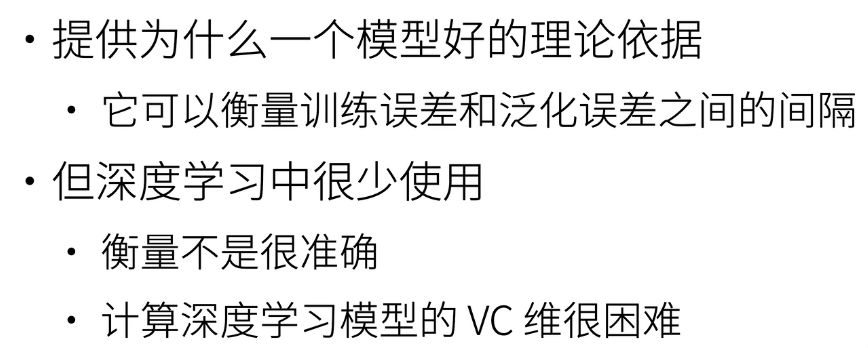

# 一、模型选择

## 1.训练误差和泛化误差

- 训练误差：模型在训练数据上的误差
- 泛化误差：模型在验证数据上的误差

***训练误差小不一定代表泛化误差小***

## 2.验证数据集和测试数据集

- 验证数据集： 一个用来评估模型好坏的数据集（不能和训练数据混在一起）
- 测试数据集： 只会用一次的数据集

## 3.K-则交叉验证

一般是在数据量不多时使用

1. 将训练数据分为K块
2. 每一次使用第K块当作验证数据集
3. 报告K个验证集的平均误差
4. 一般k=5，10

# 二、过拟合和欠拟合

| 模型容量\数据复杂度 | 简单  | 复杂  |
|:----------:|-----|-----|
|  ***低***   | 正常  | 欠拟合 |
|  ***高***   | 过拟合 | 正常  |

## 1. 模型容量

是指拟合各种函数的能力

- 低容量的模型难以拟合训练数据
- 高容量的模型可以记住所有数据

## 2. 模型容量的影响

## 3. 估计模型的容量

1. 难以在不同的种类算法间比较（树模型和深度网络）
2. 给定一个模型种类，将有两个主要因素
  - 参数的个数
  - 参数的取值范围

## 4. VC维

**对于一个分类模型，VC时一个最大数据集的大小，使得不管如何给定标号，都存在一个模型来对他完美分类**

**用处：**

 
 
## 5. 数据的复杂度

- 样本个数
- 样本元素的个数
- 多样性
- 时间，空间结构

## 6. 总结

- 模型容量要匹配数据复杂度，不然或under_fitting或over_fitting
- 统计机器学习通过数学工具来衡量模型复杂度
- 实际一般观察训练误差和验证误差