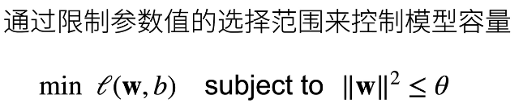
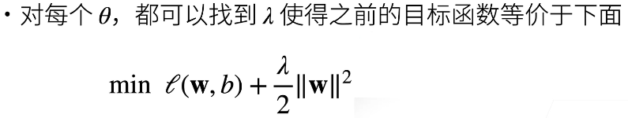
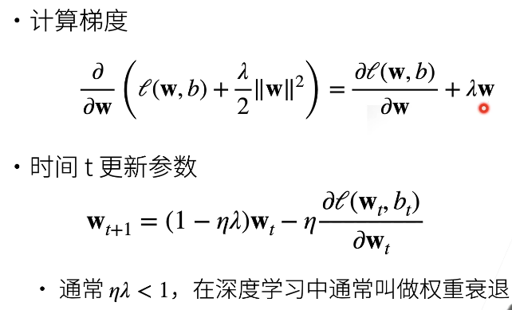

#  权重衰退

**均方函数即L2正则化**

## 1. 均方范数-硬性限制
 使用均方范数来进行硬性限制（限制W的大小）
 

- 通常不去限制b
- θ越小限制越强（更强的正则性）

## 2. 均方函数-柔性限制

超参数λ控制了正则化的强度

- λ=0：无作用
- λ越大，限制越强

## 3.梯度更新法则

[这个视频很好的解释了L2正则化](https://www.bilibili.com/video/BV1Z44y147xA)